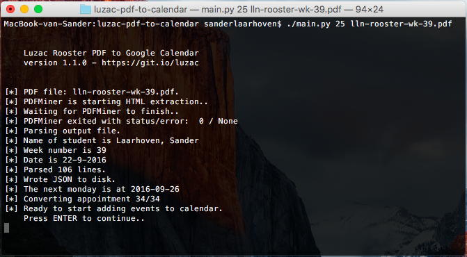

# Luzac PDF to Google Calendar
Convert PDF to Google Calendar.



### Install & Usage

Requirements
- Unix system
- Python 2.7 (3 not supported)

```
git clone https://github.com/lesander/luzac-pdf-to-calendar.git
cd luzac-pdf-to-calendar/
pip install --upgrade pdfminer
pip install --upgrade google-api-python-client
```

Create a new project at [console.developers.google.com](https://console.developers.google.com).
Select `web server (node.js)` as platform, set `http://localhost:8080` as allowed Javascript origin,
and add `http://localhost:8080/` (note the `/` at the end!) to the authorized redirect URI's.

When finished, download the `client_secret.json` and place it in the `luzac-pdf-to-calendar` folder.

For the first time, run `python googleoauth.py` and give consent to your application.

Download the latest Luzac Rooster PDF to the `luzac-pdf-to-calendar` folder.
Note the page number your schedule is on and run:
```
python ./main.py <my-page> <my-pdf>
```
Replace `<my-page>` with for example `20` and `<my-pdf>` with for example `luzac-rooster.pdf`.

When your grant token has expired, just re-run `googleoauth.py` to obtain a new token.

### Contributing
If you'd like to contribute to this project or file a bug or feature request, please head over to the issue tracker or fork this repository.

### License
This software is open-sourced under the MIT Licence (see [LICENSE](/LICENSE) for the full license). So within some limits, you can do with the code whatever you want. However, if you like and/or want to re-use it, I'd really appreciate a reference to this project page.

The software is provided as is. It might work as expected - or not. Just don't blame me.

### References & Sources
[GitHub - PDFMiner by Yusuke Shinyama](https://github.com/euske/pdfminer)

[Google Developers - Calendar API Home](https://developers.google.com/google-apps/calendar)

[Google Developers - Python Reference](https://developers.google.com/api-client-library/python/reference/pydoc)

[Google Developers - Calendar API for Python Docs](https://developers.google.com/resources/api-libraries/documentation/calendar/v3/python/latest)

[Google Developers - Console](https://console.developers.google.com)
